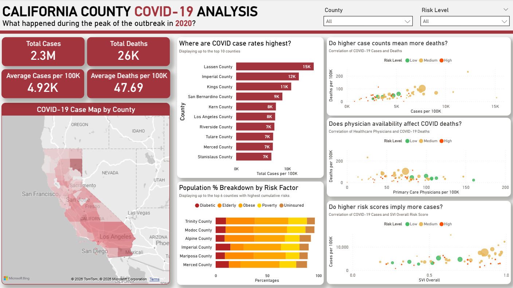

# California County COVID-19 Analysis (2020)

<p align="center">
  
  <br>
  <em>Analysis overview generated in Power BI.</em>
</p>

This project provides an **analysis of COVID-19 outcomes and risk factors across California counties in 2020**. It combines **SQL queries**, **Excel pivot tables**, and a **Power BI dashboard** to explore cases, deaths, and sociodemographic and healthcare risk factors.

This was inspired by having various transfer offers across California with the thought of how things may have been different with another choice.

## Project Overview
The analysis includes:
- COVID-19 confirmed cases and deaths by county
- Socioeconomic and structural risk factors (poverty, uninsured, elderly population)
- Healthcare access indicators (physicians per capita, hospital/urgent care access)
- Social Vulnerability Index (SVI) scores

## Project Structure
```
covid_ca_county_analysis/
│
├── data/
│   └── ca_covid_cleaned.csv          # Cleaned dataset used for analysis
├── excel/
│   └── ca_covid_excel.xlsx           # Excel workbook with pivot tables and sample charts
├── images/
│   └── ca_covid_bi_ss.png            # Screenshot of the dashboard for preview
├── powerbi/
│   └── ca_covid_bi_overview.pbix     # Power BI dashboard for visual exploration
├── sql/
│   └── covid_queries.sql             # SQL queries used to retrieve and process data
└── README.md
```

## How to Use

1. Open `ca_covid_excel.xlsx` to explore pivot tables and analyses in Excel.  
2. Open `ca_covid_bi_overview.pbix` in Power BI Desktop to interact with the dashboard.  
3. Use `ca_covid_cleaned.csv` for further analysis in other tools (Python, R, etc.).  
4. Review SQL queries in `covid_queries.sql` to see how the raw data was retrieved, joined, and queried.

## Tools Used
- **Google BigQuery / SQL**: Querying and cleaning raw COVID-19 and demographic data
- **Excel**: Pivot tables, summary statistics, exploratory analysis
- **Power BI**: Interactive dashboard visualizing cases, deaths, and risk factors along with calculations and measures

## License

This project is licensed under the MIT License.

## Credits and Data Sources
- **COVID-19 Open Data** – [console.cloud.google.com/marketplace/product/bigquery-public-datasets/covid19-open-data](https://console.cloud.google.com/marketplace/product/bigquery-public-datasets/covid19-open-data)  
  County-level COVID-19 cases and deaths, available through Google Cloud Marketplace.

- **County Data** – [https://www.ahrq.gov/data/innovations/clh-data.html](https://www.ahrq.gov/data/innovations/clh-data.html)  
  Community-level health data joined with COVID-19 data for analysis.
