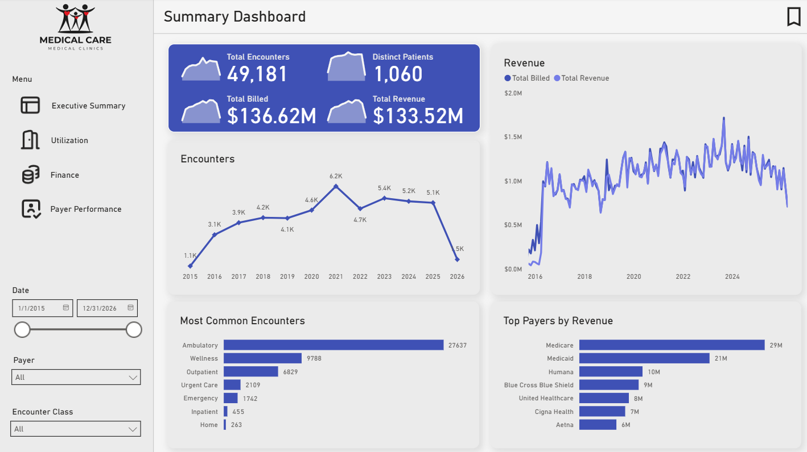
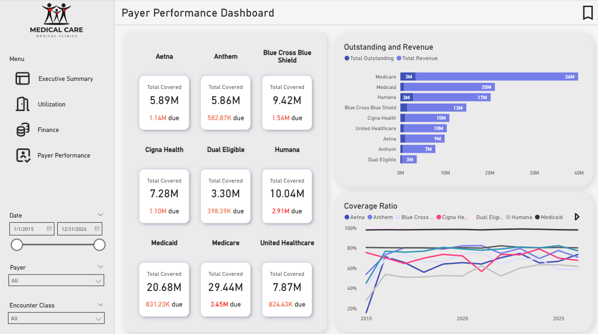

# Healthcare Operation & Revenue Cycle Analytics Dashboard (2020)

<p align="center">
  
  <br>
  <em>Analysis overview generated in Power BI.</em>
  
  <br>
  <em>An overview on payer performances.</em>
</p>

This project provides an **analysis of healthcare operations and revenue cycles with synthetic data generated by Synthea**. This utilizes **SQL queries**, **DAX**, and a **Power BI dashboard** to explore utlization, finances, and the performance of the most used payers.

## Project Overview
The analysis includes:
- Realistic yet synthetic patient records
- Healthcare operation and utilization statistics
- Finances through claims and transactions
- Payer performances across many cases
- Numerous slicers to filter across time, payers, and encounter types and bookmarks to reset to defaults.

## Project Structure
```
healthcare_analytics_dashboard/
│
├── synthea_sample/
│   ├── sample_dim_patient.csv        # Synthea data sample limited to 1,000 rows due to size limitations
│   ├── sample_dim_payer.csv
│   ├── sample_fact_claim_transactions.csv
│   ├── sample_fact_claims.csv
│   └── sample_fact_encounters.csv
├── images/
│   ├── db_financial.png              # Screenshot of dashboard pages for previewing
│   ├── db_payer.png
│   └── db_summary.png
├── powerbi/
│   └── healthcare_op.pbix            # Power BI dashboard for visual exploration
├── sql/
│   ├── kpi_metrics.png               # SQL queries to validate and explore
│   ├── raw_tables.png
│   └── schema_tables.png
└── README.md
```

## How to Use

1. Open `healthcare_op.pbix` in Power BI Desktop to interact with the dashboard.  
2. Review SQL queries in the `sql/` folder to see how the raw data was transformed, joined, and queried.

## Tools Used
- **PostgreSQL**: Querying and validating synthetic data with lifetime encounters of ~1150 patients (67456 encounters)
- **Power BI**: Interactive dashboard visualizing utilization, finances, and payer performances along with calculations and measures

## License

This project is licensed under the MIT License.

## Credits and Data Sources
- **Synthea** – [https://github.com/synthetichealth/synthea?utm_source=chatgpt.com](https://github.com/synthetichealth/synthea?utm_source=chatgpt.com)  
  Synthetic health data generation for realistic data required due to HIPAA and sensitivity to real patient data

- **SVG Repo Icons** – [https://www.svgrepo.com/](https://www.svgrepo.com/)  
  Open-licensed SVG vectors and icons used to make the dashboard more appealing
